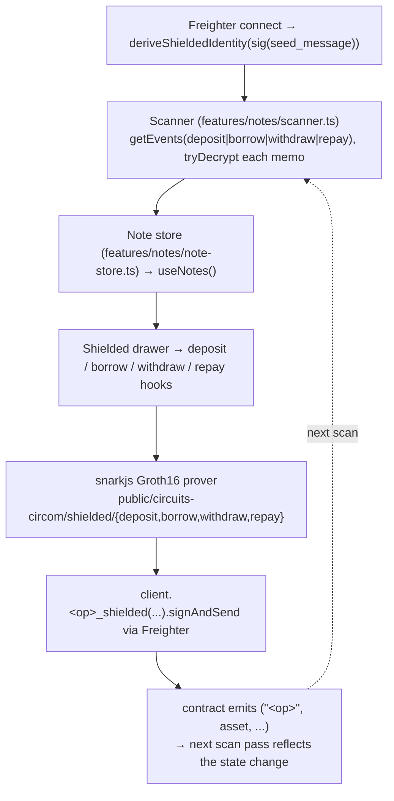

# Stellar Shield

Zcash-style shielded lending pool on Stellar. Wallet + amount stay hidden.
Deposit into a per-asset commitment tree, borrow against 4 collateral notes
with a zk-proof-verified LTV check, withdraw the loan into a wallet, or
repay by burning a same-asset deposit note against the loan. Nullifiers
guard against double-spend; encrypted memos let a fresh browser rebuild the
user's note inventory from public events alone.

## Stack

- **Frontend**: Next.js 16 (App Router, Turbopack), TypeScript, Tailwind, Base UI + local COSS primitives.
- **Circuit**: Circom 2.2.3 with snarkjs Groth16 over BLS12-381.
- **Contract**: `soroban-sdk = 22.0.8`, verifier uses Protocol 22 BLS12-381 host fns.
- **Oracle**: Reflector Pulse (SEP-40 interface) — CEX/DEX + FX feeds via Soroban simulate.
- **Wallet**: Freighter (primary), WalletConnect scaffolding present.
- **Package manager**: **Bun**.

## Testnet contract

| Item | Value |
| --- | --- |
| Contract ID | `CBLTPN2JCUHYH35OFGAYQ3NJDJC66IMFPHLOBT6PI2XKNVKPNH4FS6I4` |
| Admin | `GCGLOK2DM2Y4NGESNJBTTOHEY7EB3MO35FV5YQSZIOWV6QW6ZNRXGPXK` |
| Network | Testnet (`Test SDF Network ; September 2015`) |
| Reflector CEX/DEX | `CCYOZJCOPG34LLQQ7N24YXBM7LL62R7ONMZ3G6WZAAYPB5OYKOMJRN63` |
| Reflector FX | `CCSSOHTBL3LEWUCBBEB5NJFC2OKFRC74OWEIJIZLRJBGAAU4VMU5NV4W` |

Registered markets: `USDC/XLM`, `XLM/USDC`, `EURC/USDC`, `USDC/EURC`, `EURC/XLM`, `XLM/EURC`.

The contract ID above is **canonical** — it is what the app routes through
(`.env.local` / `features/protocol/bindings/borrow-pool.ts`). Earlier
deployments (`CBJZP45H…4N7L`, `CATPLYDP…52YX`) still exist with identical
markets but **separate pool state**; they are retired. After any redeploy,
users must re-deposit — prior pool state is unreachable. Any redeploy must
update this table, `.env.example`, and the CLI script fallbacks together, and
keep them equal.

## Roadmap status

| Track | Status |
| --- | --- |
| Phase 1 (receipt registry → real testnet) | shipped |
| Phase 2 v1 shielded pool (deposit / withdraw / borrow / repay / withdraw_loan) | shipped |
| Track L v1 self-liquidate (bond commits, liquidate circuit, health badge) | shipped |
| Track C-simple bounty payout (1×denomination per liquidation) | shipped |
| Track G-lite watchlist CLI (`bun run scan:underwater`) | shipped |
| **Track A** ivk/nk split → pre-published `loan_nullifier` + sidecar + `liquidate_shielded_v2` | shipped |
| **Track D** interest accrual on repay (`BorrowIndexAtOpen` + extended repay circuit) | shipped |
| Track E fixture harness (TS-side against on-disk fixtures) | shipped |
| Track G-full permissionless service worker (authenticated CLI mode) | shipped (needs deployed `liquidation_service_pk` slot value + matching `LIQUIDATION_SERVICE_SK` to activate) |
| Autonomous liquidation loop (`scan:underwater --trigger`) | shipped (needs `LIQUIDATOR_SECRET` Stellar signing key alongside the service sk) |
| Service keypair generator (`bun run gen:service-key`) | shipped |
| Deployment runbook + lifecycle demo doc | shipped (`docs/deployment.md`, `docs/demo.md`) |
| Multi-note deposit (`shielded-deposit-quad` circuit + `deposit-quad-prover.ts`) | experimental — circuit, verifier (`deposit_quad_verifier`), prover, and artifacts exist but are not wired into `use-deposit.ts`; not a supported flow |
| Track F UI polish | opportunistic |
| Track B FROST threshold | dropped — Track A closes the sk-drain, but the liquidation-service operator still decrypts every borrow position (see Trust model below); FROST was the only path to remove that operator trust |
| Rust-side fixture reader | blocked on `soroban-sdk` 23 (testutils build fix) |

## Setup

```bash
bun install
cp .env.example .env.local
# fill in NEXT_PUBLIC_WALLETCONNECT_PROJECT_ID (optional). Testnet
# defaults for RPC, Horizon, contract IDs, and Reflector feeds ship in
# .env.example.

bun run dev       # http://localhost:3000
bun run lint
bun run typecheck
bun run test
bun run build     # needs network access (next/font pulls Google Fonts)
```

Freighter must be on testnet and funded (fund via
[friendbot](https://laboratory.stellar.org/#account-creator?network=testnet)
or `stellar keys fund default --network testnet`).

## Architecture

Shielded pool primitives:

- **Note** = `Poseidon(amount, asset_tag, sk, salt)` commitment on a per-asset incremental Merkle tree (depth 20, 3 deposit + 3 loan trees).
- **Nullifier** = `Poseidon(sk, index)` posted at spend time; replay-guarded on chain in per-tree namespaces (deposit vs loan), so a deposit and a loan nullifier with identical bytes never collide.
- **Shielded identity** = deterministic X25519 keypair derived from the wallet's Freighter signature. Encrypted memos (ChaCha20-Poly1305 over ECDH) attach the note's `(salt, amount, index)` to each deposit / borrow tx so the user can rebuild inventory by scanning public events.

Data flow, top → bottom:



Key boundaries:

- `AdapterProvider` at `app/layout.tsx` picks Soroban vs mock adapter based on env.
- `features/markets/prices.ts` is the only place that talks to Reflector.
- `features/notes/scanner.ts` is the sole reader for building the user's note inventory; it consumes deposit + borrow (mints notes), withdraw + repay (marks nullifiers spent).
- `features/notes/note-store.ts` is the localStorage-persisted cache surfaced via `useNotes()`; each scan pass merges into it, tombstoning spent notes instead of dropping them.
- `features/shielded-pool/` owns the hooks (`useDeposit`, `useBorrow`, `useWithdraw`, `useRepay`) plus the prover wrappers.
- `features/protocol/risk-params.ts` fetches contract-side risk params once per session and exposes `getRiskParams()` / `useRiskParams()`.

## Contract lifecycle (Rust)

Source: `contracts/borrow-pool/src/lib.rs`. Shielded pool API:

| Method | Auth | Notes |
| --- | --- | --- |
| `initialize_shielded(admin, reflector, rate, risk)` | one-shot | Sets admin + rate/risk params + reflector contract. |
| `set_reserve(asset, token_contract)` | admin | Registers the SEP-41 token used for a shielded asset. |
| `set_rate_params(params)` / `set_risk_params(params)` | admin | Runtime knobs. |
| `register_market(market)` | admin | Static market metadata (borrow/collateral pair). |
| `admin_transfer(new_admin)` / `upgrade(wasm_hash)` | admin | Same address, same state. |
| `deposit_shielded(from, asset, commitment, memo)` | account | Pulls fixed denomination, appends leaf, emits `("deposit", asset)` with `(index, root, leaf, memo)`. |
| `withdraw_shielded(to, asset, proof)` | account | Verifies Groth16, checks nullifier fresh, releases denomination. |
| `borrow_shielded(from, collateral_asset, borrow_asset, proof, memo)` | account | Consumes 4 collateral nullifiers, appends loan commitment, emits `("borrow", collateral_asset, borrow_asset)`. |
| `withdraw_loan_shielded(to, asset, proof)` | account | Loan-tree variant of withdraw; releases the borrower's minted loan amount. |
| `repay_shielded(from, asset, proof)` | account | Burns loan note + same-asset deposit note (deposit >= loan). |
| `list_markets()` / `rate_params()` / `risk_params()` / `deposit_root(asset)` / `loan_root(asset)` / `total_deposit(asset)` / `total_borrow(asset)` | view | |

Circuits at `contracts/circuits/shielded-{deposit,withdraw,borrow,repay}/` — Circom 2.1.9, BLS12-381, Poseidon commitments. Verifier bytes embedded in `contracts/borrow-pool/src/vk/<circuit>/*.bin`.

## Deploy workflow

The live contract at `CBJZP...4N7L` was deployed once and upgraded in place
for each iteration (Phase 1 receipt registry → Phase 2 shielded pool). Fresh
deploys follow the same pattern:

```bash
cd contracts
stellar contract build
stellar contract deploy \
  --wasm target/wasm32v1-none/release/borrow_pool.wasm \
  --source deployer --network testnet
# → prints CONTRACT_ID

stellar contract invoke --id $CONTRACT_ID --source deployer --network testnet -- \
  initialize_shielded --admin <admin-address> \
    --reflector CCYOZJCOPG34LLQQ7N24YXBM7LL62R7ONMZ3G6WZAAYPB5OYKOMJRN63 \
    --rate '{"base_apr_bps":200,"slope_apr_bps":1500,"reserve_factor_bps":1000,"seconds_per_year":31536000}' \
    --risk '{"hf_min_bps":12500,"liquidation_bonus_bps":500,"liquidation_threshold_bps":8500,"max_ltv_bps":6250}'

# Register the SEP-41 token per asset (contract must match the deposit intent):
stellar contract invoke --id $CONTRACT_ID --source deployer --network testnet -- \
  set_reserve --asset XLM --token_contract CDLZFC3SYJYDZT7K67VZ75HPJVIEUVNIXF47ZG2FB2RMQQVU2HHGCYSC

# Same for each supported asset. Then register markets + bindings as before.
```

### Event indexing (Goldsky → Neon)

Optional — without it the app scans RPC only (the `/api/events` route
returns 503 and clients fall back). Setup:

```bash
curl https://goldsky.com | sh   # install CLI (macOS/Linux)
goldsky login                   # opens browser auth

# Turbo postgres sinks take a JDBC-style secret (note "type":"jdbc"):
goldsky secret create --name POSTGRES_SECRET_CMS4PVCAP0 --value \
  '{"type":"jdbc","protocol":"postgresql","host":"<direct-host>","port":5432,"databaseName":"neondb","user":"goldsky_writer","password":"..."}'

# Run db/schema.sql on the Neon database, then (turbo, not pipeline):
goldsky turbo apply goldsky/stellar-shield-events.yaml
goldsky turbo inspect stellar-shield-events
```

The Goldsky sink needs the **direct** (non-pooler) Neon host with a role
scoped `GRANT INSERT, UPDATE ON stellar_shield_events`; the app's
`DATABASE_URL` uses the **pooled** host. On a contract redeploy, add the
new contract ID to the `IN` list in `goldsky/stellar-shield-events.yaml`
and re-apply the pipeline. On a testnet reset, `TRUNCATE
stellar_shield_events`.

Subsequent changes: use the in-place upgrade path (same contract id, same
state) so the frontend contract id keeps working and live positions survive.

```bash
cd contracts
stellar contract build
stellar contract install \
  --wasm target/wasm32v1-none/release/borrow_pool.wasm \
  --source deployer --network testnet
# → prints WASM_HASH

stellar contract invoke \
  --id CBLTPN2JCUHYH35OFGAYQ3NJDJC66IMFPHLOBT6PI2XKNVKPNH4FS6I4 \
  --source deployer --network testnet \
  -- upgrade --wasm_hash $WASM_HASH

# Regenerate bindings if the ABI changed; storage layout must stay
# backwards-compatible or migrate state before switching.
```

## End-to-end verification

1. `bun run dev` → connect Freighter (testnet). Scanner logs "N notes decrypted" once identity derivation completes.
2. Open the shielded drawer, click Deposit on an asset tile. Freighter signs `deposit_shielded`; on confirm the leaf lands and a new deposit note appears (`#index` badge).
3. Deposit at least 4 collateral notes of one asset; the `Borrow shielded` panel surfaces viable `collateral → borrow` pairs. Trigger a borrow — prover takes ~15-30s.
4. On the fresh loan note row, click **Claim** — receives the loan amount into Freighter via `withdraw_loan_shielded`.
5. **Claim and Repay are mutually exclusive**, not sequential: both spend the same loan nullifier `Poseidon(sk, loan_index)`, so a claimed loan can no longer be repaid (and vice versa). To exercise repay instead, skip step 4, deposit a repay-source note in the loan's asset ≥ the loan amount, then click **Repay** on the unclaimed loan note → both nullifiers burn, loan note vanishes. Note v1 leaves the original collateral burned either way (collateral recovery is deferred — see below), so repay is a position-closing operation, not a way to get collateral back.
6. Any Withdraw button on a deposit note calls `withdraw_shielded` and receives the fixed denomination.
7. Refresh browser → notes hydrate from the persisted local store; the scanner merges public events over the RPC retention window (~7 days). If browser storage is cleared after events expire, those notes are permanently unspendable (accepted on testnet).
8. `bun run lint && bun run typecheck && bun run test && bun run build` all green.

## Deferred

- **Collateral recovery on repay**: v1 leaves original collateral notes burned. v2 repay circuit will mint recovered collateral commitments back to the deposit tree. (Interest accrual on repay — the `borrow_index` snapshot / `repay_amount = loan × index` check — **shipped** under Track A/D; only collateral recovery remains deferred.)
- **Liquidation (self-liquidate)**: **shipped end-to-end**. Extended borrow circuit publishes 3 bond commitments; contract persists `LiquidationBond` keyed by the loan commitment; separate liquidate circuit (`shielded-liquidate`, 1476 non-linear constraints) proves a position is underwater and burns the loan nullifier via `liquidate_shielded`. Frontend `useLiquidate` hook + drawer "Liquidate" button + `LoanHealthBadge` render live health factors from cached Reflector prices. Dual-recipient memo encoding + admin-configured `liquidation_service_pk` slot are on-chain prerequisites for a permissionless off-chain service.
- **Liquidation (off-chain service worker)**: **Track A shipped end-to-end.** Borrow circuit gains a `loan_nullifier = Poseidon(sk, borrow_commitment)` public signal that lands in a `LoanNullifier(loan_commit)` sidecar at borrow-time. New `shielded-liquidate-v2` circuit (933 non-linear, pot12) drops sk from the witness — a service holding only the memo openings can prove. New `liquidate_shielded_v2` contract fn wraps the verifier with sidecar cross-checks. `useLiquidate` fetches the sidecar in parallel with the bond and branches: present → v2 path, absent → v1 fallback so grandfathered pre-A bonds stay borrower-self-liquidatable. Design ratified in `docs/liquidation-design.md` §Track A. FROST/threshold decryption (Track B) is now a pure decentralization layer on top — no additional circuit changes.
- **Other deferred**: automated e2e prove→submit→verify testnet harness (all 3 recent hotfixes — pub-signal order, G2 encoding, Merkle budget — would have been caught by one).
- **Reflector on-chain commitment cross-check**: borrow circuit publishes a Poseidon commitment over the oracle price; the contract now enforces oracle freshness but not the commitment match. Waiting on a paired oracle attestation channel.
- **Rust unit tests**: soroban-sdk `testutils` feature triggers an upstream ed25519-dalek / rand_core conflict against soroban-env-host 22.1.x. Fixture cross-checks in `contracts/borrow-pool/tests/{poseidon,merkle}_fixtures.txt` cover the primitives until soroban-sdk 23 lands.

## Trust model & privacy limitations

Testnet stage. These are honest limitations, not solved problems:

- **Shielded identity is derived from a Freighter signature** (a secret),
  `features/notes/use-shielded-identity.ts` — signed once per browser profile,
  seed cached in localStorage. The old address-derived scheme (which anyone
  could recompute from a public G-address) is retained only as a legacy
  decrypt/spend fallback for notes minted before the migration; new notes are
  never minted under it. Note that residual privacy is still bounded by the
  anonymity set below.
- **The liquidation-service operator sees every position.** Borrow memos are
  dual-encrypted to the borrower and the service key, so an operator holding
  `LIQUIDATION_SERVICE_SK` decrypts every borrower's collateral, loan size, and
  entry price. Privacy holds against outside observers, not the operator.
  `LIQUIDATION_SERVICE_SK` decrypts all borrow memos — it must never be placed
  in CI secrets used for public deploys; rotate via `bun run gen:service-key`
  if exposed.
- **Anonymity set is effectively zero** at current testnet volume with fixed
  denominations. Timing/amount correlation links deposits to withdrawals
  regardless of the cryptography.
- **Oracle price commitment is not cross-checked on-chain** (the contract
  enforces freshness only). A malicious client can commit to a price that
  differs from Reflector; `bun run scan:underwater` monitoring is the interim
  detection. See `docs/REMEDIATION.md` for the sequenced fixes (R1, R3, R7).

## Commands cheat sheet

```bash
# Dev
bun install
bun run dev
bun run lint
bun run typecheck
bun run test
bun run build

# Contract
cd contracts
stellar contract build
stellar contract install --wasm target/wasm32v1-none/release/borrow_pool.wasm --source deployer --network testnet
stellar contract invoke --id CBLTPN2JCUHYH35OFGAYQ3NJDJC66IMFPHLOBT6PI2XKNVKPNH4FS6I4 --network testnet -- list_markets

# Bindings
stellar contract bindings typescript --contract-id CBLTPN2JCUHYH35OFGAYQ3NJDJC66IMFPHLOBT6PI2XKNVKPNH4FS6I4 --network testnet --output-dir /tmp/bindings

# Liquidation watchlist / triage (Tracks G-lite + G-full)
# Watchlist mode — no service key: enumerate every live
# LiquidationBond (skipping ones already burned by liquidate events)
# sorted oldest first. Read-only; does not touch memo openings.
bun run scan:underwater
EVENTS_API_URL=https://<app>/api/events bun run scan:underwater

# Authenticated triage — service key set: also decrypt each borrow
# memo with the service X25519 sk, fetch the current Reflector price,
# and flag bonds whose openings prove `debt * threshold > collateral
# * current_price * 10_000` — the same inequality the liquidate
# circuit enforces. Underwater bonds sort first, marked with **.
# LIQUIDATION_SERVICE_SK must match the on-chain LiquidationServicePk.
LIQUIDATION_SERVICE_SK=0x... bun run scan:underwater
```
