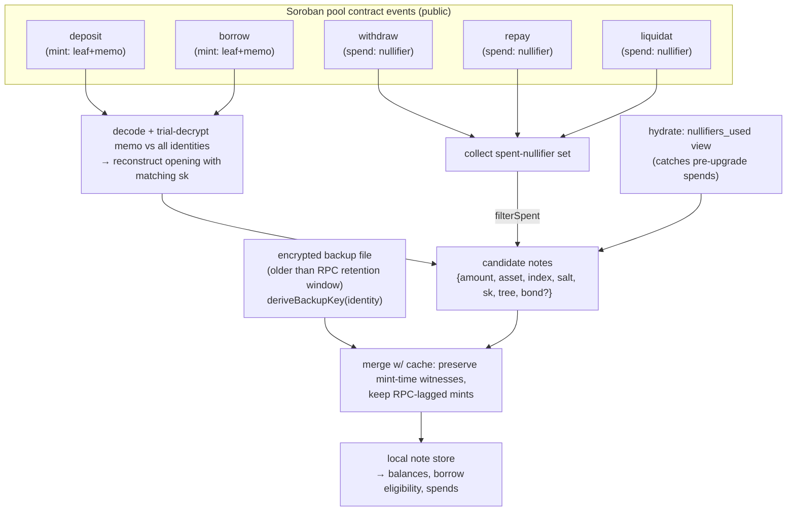
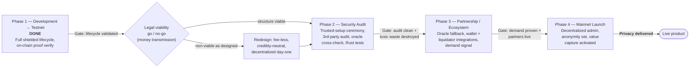

# Stellar Shield

## Borrow in the Open, Keep Your Positions in the Dark
### A privacy-preserving lending pool on Stellar/Soroban with on-chain zero-knowledge borrow-eligibility verification

**Version:** 0.1 (draft) | **Date:** 2026-07-13 | **Stage:** Testnet technical validation — not a launched product
**Companion documents:** [BRD.md](./BRD.md) (business), [PRD.md](./PRD.md) (product/technical requirements), [REMEDIATION.md](./REMEDIATION.md) (engineering risk register)

> **Status and honesty.** This paper describes a system that has completed a full
> technical validation on Stellar testnet: the shielded deposit → borrow →
> repay/liquidate lifecycle runs end-to-end with real on-chain proof
> verification. It has **zero users, zero TVL, and zero revenue**. The
> cryptography works; privacy is not yet *delivered*, because delivered privacy
> requires an anonymity set that only real adoption provides. Market figures in
> §2 size the opportunity, not this product's traction. Every non-obvious
> technical claim is grounded in the implementation with a `file:line`
> reference. Two components — the trusted setup and the on-chain oracle-price
> cross-check — are explicit mainnet blockers and are labelled as such throughout.

---

## Table of Contents

1. Abstract
2. Introduction and Motivation
3. Related Work and Positioning
4. Data Model
5. Cryptographic Construction
6. Circuits
7. Contract Operations and State Transitions
8. Note Encryption, Memo, and Shielded Identity
9. Oracle Integration
10. Liquidation Mechanism
11. Client-Side Inventory and Recovery
12. On-Chain vs Off-Chain Data Boundary
13. Security Model and Assumptions
14. Privacy Model
15. Threat Model
16. Economic Model
17. Roadmap, Known Limitations, and Mainnet Gates
18. Conclusion
19. References and Sources

---

## 1. Abstract

Public-blockchain lending is radically transparent: a wallet's collateral, loan size, health factor, and liquidation price are readable by anyone. That transparency is a liability for serious borrowers — it enables liquidation front-running, financial doxxing, and copy-trading — and no lending protocol on Stellar offers position privacy today. Stellar Shield is a privacy-preserving lending pool on Stellar's Soroban smart contract platform. It lets a user deposit collateral, prove they are eligible to borrow, and take a loan without revealing their wallet, balances, or position size on-chain. Eligibility — an LTV check against a live oracle price — is proven with a zero-knowledge proof and verified directly on-chain using the Protocol 22 BLS12-381 host functions (CAP-0059), with a shielded pool modeled on the Zcash note/nullifier design. The project has completed a full technical validation on testnet: the shielded deposit → borrow → repay/liquidate lifecycle runs end-to-end with real on-chain proof verification. This establishes a first-mover technical position for zero-knowledge applications on Stellar. It does **not** yet establish product-market fit. Stellar Shield has zero users, zero TVL, and zero revenue as of this writing; it is a testnet technical validation, not a launched product, and this paper treats demand as an open hypothesis rather than a proven fact.

---

## 2. Introduction and Motivation

### 2.1 The transparency problem in DeFi lending

Transparent lending markets publish a borrower's entire financial position by default. What reads as a virtue — auditability, composability — is, for a leveraged participant, a standing exposure. Three concrete harms follow directly from it:

- **Liquidation front-running.** Bots watch public health factors and race to trigger or profit from liquidations at the borrower's expense. The information needed to attack a position is the same information the protocol must publish to operate.
- **Financial doxxing.** A wallet address ties a real balance sheet to a public identity permanently. Every position taken against that address is retained and correlatable indefinitely.
- **Copy-trading and strategy leakage.** Loan sizes and entry levels reveal a strategy the moment it lands on-chain. For funds and market makers, execution *is* the edge, and public execution surrenders it.

For institutional and professional participants, this transparency is frequently the single reason on-chain lending is a non-starter. Position privacy is therefore not a cosmetic feature but a precondition for a class of users to participate at all.

### 2.2 The opportunity on Stellar

Stellar's DeFi ecosystem is small but growing quickly, and it has only recently become technically capable of on-chain zero-knowledge verification. On-chain DeFi TVL on Stellar crossed $200M for the first time in late April 2026, printing ~$197.4M on 2026-04-24, after sitting under $12M in November 2024 and near $46M in May 2025 — roughly 284% year-over-year growth through 2025 [S1, S2]. The growth is led by lending and tokenized real-world assets; Blend, Stellar's main lending protocol, holds ~$110M TVL [S1]. Critically, Protocol 22 shipped to mainnet on 2024-12-05, introducing the CAP-0059 BLS12-381 host functions that make on-chain zk-SNARK verification practical [S3, S4]. That capability is roughly 18 months old as of this writing — Stellar Shield builds on a primitive that did not exist before late 2024. The surrounding ecosystem is non-trivial (Stellar reports ~10.1M total addresses and 5.1B operations since 2015 [S13]) and Soroban development is active (54 projects in Stellar's Security Audit Bank as of Feb 2026; 160+ funded via the Soroban adoption fund [S5]) — yet shielded lending is absent from all of it.

The lending primitive itself is neither exotic nor unproven. DeFi lending protocols held roughly $54B in deposits as of April 2026, with Aave V3 alone at ~$19.4B, tracked across 380+ protocols on 80+ chains [S6, S7]; Aave grew from ~$8B in early 2024 to $40B+ by August 2025 [S8]. Demand for collateralized on-chain borrowing is established at tens of billions of dollars — and Stellar's share of it is tiny, leaving room to compete on a dimension no lending incumbent offers.

The appetite for on-chain privacy is likewise demonstrated rather than hypothesized. Zcash — whose note/nullifier design Stellar Shield's shielded pool is modeled on — carried a ~$9–9.5B market cap (rank ~#14) in May 2026, and more tellingly, over 30% of ZEC supply (>4.9M ZEC) sat in the shielded pool by May 2026, up from ~8% in early 2024, with shielded transactions reaching 59.3% of activity in February 2026 [S9]. Privacy usage is *growing* as a share of a multi-billion-dollar asset. On the professional side, Flashbots data put cumulative Ethereum MEV over $1.8B by mid-2025 ($40–60M/month), and by mid-2025 more than 50% of high-value Ethereum transactions were routed through private channels [S10] — direct evidence that sophisticated actors already pay to hide their intent from a transparent chain, and that public execution is a recognized barrier to institutional participation.

That same evidence carries a cautionary tale, and this paper keeps it in view. Tornado Cash peaked near $1.17B TVL (Oct 2021), held ~$460.6M at the time of sanctions, and processed over $7B in total volume before OFAC sanctioned it on 2022-08-08, after which its TVL fell ~60% within weeks [S11, S12]. Aztec — a better-funded, dedicated privacy team — sunset its Aztec Connect privacy rollup (sequencer stopped 2024-03-31), explicitly because it could not decentralize a single-node system without a wholesale re-architecture [S14]. The market wants privacy; the record shows it is hard to deliver in a way that is both decentralized and legally durable.

The net thesis is a real, unserved intersection: a fast-growing but privacy-blind lending ecosystem (Stellar), a large and proven lending category (DeFi lending at tens of billions), and a demonstrated, growing appetite for on-chain privacy — bounded by precedents that keep the risk honest. Stellar Shield is a first-mover technical bet on that intersection, not a product with traction.

---

## 3. Related Work and Positioning

Stellar Shield sits at the intersection of several established lines of work, none of which individually occupies its position.

**Zcash — shielded transfers via notes and nullifiers.** Zcash is the design inspiration for Stellar Shield's shielded pool: value is held as commitments ("notes") in a Merkle set, and spends are authorized by publishing a nullifier that prevents double-spends without revealing which note was consumed. The scale and growth of Zcash's shielded pool — >30% of supply and a majority of transactions by early 2026 [S9] — is the strongest available evidence that a shielded-pool model attracts real, sustained usage. Zcash shields *transfers*; it has no borrowing primitive.

**Tornado-style pools — fixed-denomination mixing.** Tornado Cash and similar designs provide anonymity through fixed-denomination transfer mixing over a shared pool. They establish both the mechanism and its limits: privacy is a function of the crowd, and the design's legal and operational history (§16, §17) is a direct precedent for the risks Stellar Shield names. These pools mix payments; they add no productive financial primitive on top of the pool.

**Aztec — general private smart contracts.** Aztec pursued general-purpose private computation on Ethereum. Its Aztec Connect sunset (2024-03-31), attributed to the difficulty of decentralizing a single-sequencer system [S14], is a cautionary precedent rather than a competing product, and it directly informs the operator-centralization limitation Stellar Shield discloses.

**Transparent lending — Aave, Compound, Blend.** Aave and Compound define the collateralized-borrowing primitive at scale on Ethereum [S6, S7, S8]; Blend is its principal analogue on Stellar [S1]. All expose every position publicly. They establish that the lending mechanism Stellar Shield implements is standard and proven — only its privacy is novel.

### 3.1 Positioning statement

In one phrase: **Stellar Shield is a shielded, on-chain-verified lending pool on Stellar** — the only system combining all four properties. Each dimension has precedent in isolation; the combination does not exist elsewhere:

> **For** professional and privacy-conscious borrowers on Stellar **who** need collateralized leverage but cannot afford to broadcast their balance sheet, position size, and liquidation level to the entire chain, **Stellar Shield is** a privacy-preserving lending pool **that** lets you prove borrow eligibility and take a loan while your wallet, balances, and position size stay hidden on-chain. **Unlike** transparent Stellar lenders (Blend and every other Stellar lending market), which expose every position publicly, **and unlike** shielded-*transfer* tools (Zcash, Tornado-style pools), which hide payments but offer no borrowing primitive, **Stellar Shield** is the only option that combines shielded privacy *with* a lending market on Stellar — **because** eligibility is enforced by a real zero-knowledge proof verified *on-chain* via Protocol 22 BLS12-381 host functions, proofs are generated *client-side* so no server ever custodies a user's keys, and a user's private position can be rebuilt from public chain data alone.

The concrete technical delta against a transparent Stellar lender (Blend) is measurable, not rhetorical: every borrow carries one on-chain Groth16 verification over BLS12-381 (16 IC points, §5.1) that spends 4 collateral nullifiers and mints a loan note, over per-asset commitment trees of depth 20 — a `2^20 = 1,048,576`-leaf anonymity *capacity* per asset — with zero balances or position sizes written to chain. Blend writes all of them. The defensibility is the intersection itself — shielded *and* lending *and* on Stellar *and* on-chain-verified. Replicating it requires ZK, lending, oracle, and in-browser proving competence in one place. This describes a technical and competitive position, not delivered privacy: capacity is not the same as a realized anonymity set, which requires real pool volume (§14) that testnet does not provide.

---

## 4. Data Model

Stellar Shield stores no account balances. The pool's entire liability side is a set of *notes* — Zcash-style commitments whose openings live only in the owner's browser. This section defines the note, the commitment scheme, the per-asset Merkle trees, the nullifier set, and the two liquidation-support sidecars.

### 4.0 Notation

Symbols used throughout §4–§10. All field elements are over the BLS12-381 scalar field `F_r` (§5.2).

| Symbol | Domain | Meaning | Public? |
|---|---|---|---|
| `sk` | `F_r` | Shielded spending key; also the memo-decryption key (§8.2). | private |
| `amount` | `F_r` | Note value in whole units. | private |
| `asset_tag` | `{0,1,2}` | Asset index into `SUPPORTED_ASSETS = [XLM, USDC, EURC]`. | public |
| `salt` | `F_r` | Per-note random field element; unlinks equal-value notes. | private |
| `index` | `u64` | Leaf position in a Merkle tree, assigned at append. | public |
| `cm` | `F_r` | Note commitment `= Poseidon(amount, asset_tag, sk, salt)`. | public |
| `nf` | `F_r` | Nullifier `= Poseidon(sk, index)`; spend tag, unlinkable to `cm`. | public (at spend) |
| `nf_loan` | `F_r` | Loan nullifier `= Poseidon(sk, cm_borrow)`; enables keyless liquidation (§10). | public (sidecar) |
| `root` | `F_r` | Current Merkle root of a per-asset tree; `DEPTH = 20`. | public |
| `p` | `F_r` | Oracle price (USD, 14-decimal) folded into the borrow proof (§9). | private (committed) |
| `hf_min` | bps | Minimum health factor, cross-checked against on-chain risk params. | public |
| `max_ltv` | bps | Maximum loan-to-value, cross-checked against on-chain risk params. | public |
| `π` | Groth16 | Proof `(A, B, C)` over BLS12-381 verified on-chain (§5.1). | public |

### 4.1 The note

A note is the atomic unit of value in the pool. One note represents one unit of a fixed denomination of one asset, held privately by whoever knows its secret key. Notes come in two kinds — *deposit notes* (collateral supplied to the pool) and *loan notes* (debt minted by a borrow) — distinguished by which tree carries the commitment.

The client-side note struct (`features/notes/note.ts:36`) is the full opening:

| Field | Type | Public? | Meaning |
|---|---|---|---|
| `amount` | bigint | private | Whole-unit value. Fixed per asset by `DENOMINATION` for deposit notes; variable (oracle × collateral × LTV) for loan notes. |
| `asset` | `"XLM" \| "USDC" \| "EURC"` | private | Asset symbol. Encoded into the commitment as a numeric `assetTag` (index into `SUPPORTED_ASSETS`, `note.ts:90`). |
| `index` | number | public | Leaf position in the note's Merkle tree. Assigned by the contract at append time. |
| `salt` | bigint | private | Per-note random field element (`randomFieldElement`, `note.ts:120`). Breaks commitment linkability across notes of equal value. |
| `sk` | bigint | private | Owner secret key. Same value reproduces both commitment and nullifier — only the holder can spend. |
| `tree` | `"deposit" \| "loan"` | public | Which per-asset tree holds the commitment. |
| `openedAt` | number? | public | Mint event's `ledgerCloseTime`, for UI ordering. |
| `bond` | object? | private | Liquidation-bond openings (salts + collateral value + oracle price), present only on loan notes from a Track-L borrow (`note.ts:51`). |
| `witness` | object? | derived | Cached Merkle inclusion path pinned at mint time (`note.ts:78`). |

`DENOMINATION` (`note.ts:20`) fixes deposit-note value per asset — `XLM: 100`, `USDC: 10`, `EURC: 10` whole units — and the contract enforces it on every deposit (`notes.rs:22`, checked at `lib.rs:404`). Fixed denominations are what make one deposit commitment indistinguishable from another: every XLM deposit note is worth exactly 100 XLM, so the on-chain leaf leaks nothing beyond "a deposit happened." `COLLATERAL_NOTES_PER_BORROW = 4` (`note.ts:32`) is baked into the borrow circuit's trusted setup; a borrow always spends exactly four collateral notes.

### 4.2 Commitment scheme

Two Poseidon hashes over the BLS12-381 scalar field define a note's public footprint (`note.ts:101`, `note.ts:112`):

```
commitment = Poseidon(amount, assetTag, sk, salt)
nullifier  = Poseidon(sk, index)
```

The commitment is what the contract appends to a tree. Poseidon is one-way, so a chain observer holding the commitment cannot recover `amount`, `sk`, or `salt`. The nullifier is a spend tag: derived from `sk` and the leaf `index`, it is unlinkable to the commitment yet deterministically reproducible by the owner — so the owner can prove "I am spending a note I own" while the contract enforces "this note has not been spent before."

Poseidon is implemented three times and MUST stay byte-identical: TypeScript (`features/notes/poseidon.ts`), the Rust contract port (`contracts/borrow-pool/src/poseidon.rs`), and the circom circuits (`-p bls12381`). Any drift breaks every proof. See §5.2.

### 4.3 Per-asset Merkle trees

Commitments accumulate into **incremental Merkle trees, depth 20** (`merkle.ts:10`, `merkle.rs:26`) — `2^20 = 1,048,576` leaves per tree. There are **separate deposit and loan trees, one pair per asset**. Membership in the deposit tree for XLM proves "this is live XLM collateral"; membership in the loan tree proves "this is an outstanding XLM debt."

The contract never stores full-tree hashes. On-chain state per tree is only three slots (`state.rs:240-317`): a `frontier` (the right-most partial path, one node per level, ≤ depth entries), a leaf counter `next_index`, and the current `root`. Appending a leaf recomputes exactly `DEPTH` interior hashes by walking the frontier bottom-up (`merkle.rs:51`). The JS and Rust `append` are bit-identical so a client can maintain its own copy of the tree and produce inclusion witnesses without asking the contract.

On-chain tree state (`state.rs`, `PersistentKey` variants keyed by asset `Symbol`):

| Storage key | Type | Role |
|---|---|---|
| `DepositRoot(asset)` | `BytesN<32>` | Current deposit-tree root. |
| `DepositFrontier(asset)` | `Vec<BytesN<32>>` | Right-most partial path, ≤ depth nodes. |
| `DepositNextIndex(asset)` | `u64` | Next free deposit leaf. |
| `LoanRoot(asset)` | `BytesN<32>` | Current loan-tree root. |
| `LoanFrontier(asset)` | `Vec<BytesN<32>>` | Loan-tree frontier. |
| `LoanNextIndex(asset)` | `u64` | Next free loan leaf. |

> **Limitation — single live root.** The contract stores only the *current* root per tree; there is no ring buffer of recent roots. Spend paths check the prover's attested root against the one live value (`lib.rs:728` withdraw, `lib.rs:830` borrow, `lib.rs:1082` repay), rejecting on any mismatch. A concurrent append by another user shifts the root and invalidates any proof already generated against the prior root, forcing a re-prove. This is a correctness-preserving trade-off (no stale-root double-spend surface) that costs liveness under contention. A recent-roots window is the standard upgrade path.

### 4.4 Nullifier set

Spent notes are recorded in a global nullifier set (`state.rs:171`): `Nullifier(BytesN<32>) -> true` in persistent storage, one slot per spent note. Every spend path checks freshness before verifying the proof and marks the nullifier after. The set is append-only and never pruned — a nullifier, once present, permanently retires its note. The public view `nullifiers_used(Vec<BytesN<32>>) -> Vec<bool>` (`lib.rs:345`) lets a client bulk-query spent status.

### 4.5 Liquidation-bond record and sidecars

To let a third party liquidate an underwater loan *without learning the borrower's identity*, a borrow pins a public commitment tuple keyed by the loan commitment. `LiquidationBond` (`state.rs:56`, written at `lib.rs:911`):

| Field | Type | Meaning |
|---|---|---|
| `borrow_amount_commit` | `BytesN<32>` | Poseidon commit to the loan amount. |
| `collateral_value_commit` | `BytesN<32>` | Commit to collateral value at open. |
| `borrow_price_commit` | `BytesN<32>` | Commit to the collateral asset's oracle price at open. |
| `borrow_asset_tag` / `collateral_asset_tag` | `u32` | Asset tags. |
| `oracle_epoch` | `u64` | Oracle timestamp used at open. |
| `opened_at` | `u64` | Ledger timestamp at borrow. |

Two per-loan sidecars, both keyed by loan commitment (`state.rs:42-50`):

- **Loan-nullifier sidecar** — `LoanNullifier(loan_commitment) -> BytesN<32>` (`state.rs:204`, written `lib.rs:926`). Pre-publishes the loan's nullifier so a liquidation service worker that holds only memo openings — never the borrower's `sk` — can trigger the v2 liquidation path (`lib.rs:1307`). Absent for pre-Track-A loans, which fall back to the sk-binding v1 circuit.
- **Borrow-index-at-open sidecar** — `BorrowIndexAtOpen(loan_commitment) -> u128` (`state.rs:221`, written `lib.rs:932`). Snapshots the accrual index at open so repay can charge `loan_amount × index_now / index_at_open`. Absent → the loan is grandfathered as zero-interest (ratio collapses to 1.0, `lib.rs:1108`).

---

## 5. Cryptographic Construction

### 5.1 Proof system

Every shielded operation is gated by a **Groth16 proof over BLS12-381**, verified inside the Soroban contract using the Protocol 22 (CAP-0059) native host functions (`verifier.rs:16-18`). All verifiers share the same structure (`verifier.rs:47-88`):

```
e(-A, B) · e(alpha, beta) · e(vk_x, gamma) · e(C, delta) == 1
   where  vk_x = IC[0] + Σ_i pub_signals[i] · IC[i+1]
```

implemented as `bls.pairing_check([−A, alpha, vk_x, C], [B, beta, gamma, delta])` after accumulating `vk_x` via `g1_mul`/`g1_add`. Each verifier hard-asserts `pub_signals.len() + 1 == ic_len`. Verifying-key constants are uncompressed BLS bytes embedded via `include_bytes!` — G1 = 96 bytes (x‖y), G2 = 192 bytes (`verifier.rs:26-45`). IC point counts per circuit: deposit 4, deposit-quad 7, borrow 16, withdraw 5, repay 8, liquidate 8, liquidate-v2 6.

### 5.2 Poseidon hash

Commitments and nullifiers use the optimized circomlib Poseidon over the BLS12-381 scalar field. `FR_ORDER = 0x73eda753299d7d483339d80809a1d80553bda402fffe5bfeffffffff00000001` (`poseidon.ts:20`). Full rounds `R_F = 8`; partial rounds `R_P = {t3:57, t5:60, t7:63}` (`poseidon.ts:23-25`); input widths 2/4/6 → state t=3/5/7. Three copies must stay byte-identical: TS (`poseidon.ts`), Rust (`poseidon.rs`), and circom; constants are shared from `poseidon-constants.json` → `poseidon_constants.rs`.

### 5.3 Merkle trees

Zcash-pattern incremental tree, `DEPTH = 20` → 1,048,576 leaves (`merkle.rs:25`). Only root + DEPTH-frontier + leaf counter are stored on-chain; full hashes are never stored and witnesses are maintained client-side. Zero hashes: `zero[0]=Fr::zero()`, `zero[i]=Poseidon(zero[i-1], zero[i-1])` (`merkle.ts:21`), precomputed in `merkle_zeros.rs` (recomputing on-chain would exceed the CPU budget past ~5 levels). `append_four_aligned` (`merkle.rs:88`) computes a 4-leaf subtree in 3 hashes then walks up DEPTH-2 levels (21 total vs 80) — the basis of the quad-deposit optimization. Two logical trees per asset (deposit, loan) share the algorithm with separate state; bounty notes from liquidation append to the collateral deposit tree (`lib.rs:1254`).

### 5.4 Commitment, nullifier, and asset encoding

```
commitment      = Poseidon(amount, asset_tag, sk, salt)      note.ts:101
nullifier       = Poseidon(sk, index)                        note.ts:112
loan_nullifier  = Poseidon(sk, borrow_commitment)            borrow.circom:197 (Track A)
```

`asset_tag` is the index in `SUPPORTED_ASSETS = [XLM, USDC, EURC]` → {0,1,2}. `randomFieldElement` uses `crypto.getRandomValues` reduced mod `FR_ORDER` (negligible bias, `note.ts:120`).

### 5.5 Proof encoding (`features/shielded-pool/proof-encoding.ts`)

Byte layout for Soroban's `G1Affine::from_array` / `G2Affine::from_array`:

- **G1**: 96 bytes = 48-byte big-endian X ‖ 48-byte big-endian Y.
- **G2**: 192 bytes = (X_c1 ‖ X_c0) ‖ (Y_c1 ‖ Y_c0), each 48 bytes — **c1 before c0** (a portability footgun that was the subject of a past hotfix; `proof-encoding.ts:4-10`, test-covered).

`FP_BYTES = 48`; `INFINITY_BYTE = 0x40` marks the point at infinity. This convention matches `contracts/scripts/vk-json-to-bytes.ts`, so proof bytes and stored VK bytes round-trip identically.

---

## 6. Circuits

All seven circuits are compiled Groth16 over BLS12-381 (`-p bls12381`), Merkle depth 20, 4 collateral notes per borrow. A shared `MerkleInclusion` template booleanizes each path bit, selects `(current, sibling)` by the bit, hashes with `Poseidon(2)`, and asserts the reconstructed root equals the public root.

> **Signal-ordering note.** Circom `public [...]` lists *declaration* order, but snarkjs emits circuit **outputs first**, then declared public inputs. The runtime `public_signals` vector the contract reads follows the *snarkjs* order; where the two differ (deposit, deposit-quad), the contract's indexing is authoritative and the in-source comments describe declaration order only.

### 6.1 shielded-deposit — 3 public signals
Runtime order `[0]=commitment, [1]=amount, [2]=asset_tag`. Private `sk, salt`. Constraint: `commitment === Poseidon(amount, asset_tag, sk, salt)`. Amount==denomination is enforced in Rust, not the circuit. *Proves:* the caller knows an opening of a well-formed note for the declared amount and asset.

### 6.2 shielded-deposit-quad — 6 public signals
Order `[0..3]=commitment[0..3], [4]=amount, [5]=asset_tag`. Private `sk` (shared), `salt[4]`. Constraints: `commitment[i] === Poseidon(amount, asset_tag, sk, salt_i)` for i∈0..3. *Proves:* four notes minted under one identity in a single verification (used to stay under Soroban's 100M-CPU per-tx cap).

### 6.3 shielded-borrow — 15 public signals, `Borrow(20, 4)`
Order: `borrow_amount, borrow_asset_tag, collateral_asset_tag, hf_min_bps, max_ltv_bps, deposit_root, borrow_commitment, nullifiers[0..4], borrow_amount_commit, collateral_value_commit, borrow_price_commit, loan_nullifier`. Private: `sk, borrow_salt, collateral_amounts[4], collateral_salts[4], collateral_indices[4], collateral_paths[4][20], collateral_bits[4][20], oracle_price, bond_salt_{amount,value,price}`. Constraints (`borrow.circom:120-200`):
1. For each of 4 notes: reconstruct commitment, Merkle inclusion at `deposit_root`, and `Poseidon(sk, index[i]) === nullifiers[i]`.
2. `borrow_commitment === Poseidon(borrow_amount, borrow_asset_tag, sk, borrow_salt)`.
3. `total_collateral_value = Σ collateral_amounts[i] · oracle_price`.
4. **Health factor:** `total_collateral_value · 10000 ≥ borrow_amount · hf_min_bps`.
5. **Max LTV:** `borrow_amount · 10000 ≤ max_ltv_bps · total_collateral_value`.
6. Three bond commitments over amount, collateral value, and oracle price.
7. **Track A:** `Poseidon(sk, borrow_commitment) === loan_nullifier`.

*Proves:* the caller owns 4 unspent deposit notes whose USD value backs the loan within the policy band, and mints a loan note plus a service-triggerable nullifier and three bond commitments. (`hf_min_bps`/`max_ltv_bps` are public inputs the contract cross-checks against on-chain risk params, so a caller cannot manufacture a friendlier LTV.)

### 6.4 shielded-withdraw — 4 public signals, `Withdraw(20)`
`[0]=asset_tag, [1]=denomination, [2]=deposit_root, [3]=nullifier`. Reconstruct commitment, Merkle inclusion, `Poseidon(sk, leaf_index)===nullifier`. Reused for both `withdraw_shielded` (deposit tree, fixed denomination) and `withdraw_loan_shielded` (loan tree, variable amount).

### 6.5 shielded-repay — 7 public signals, `Repay(20)`
`[0]=asset_tag, [1]=loan_root, [2]=deposit_root, [3]=loan_nullifier, [4]=deposit_nullifier, [5]=borrow_index_snapshot, [6]=borrow_index_now`. Loan-side and deposit-side commitment + inclusion + nullifier derivation; **`Num2Bits(128)` range-checks on both index signals** (prevents a `snapshot + 2^128` attack that would pass the contract's low-128 field read while inflating the field value); **solvency:** `deposit_amount · borrow_index_snapshot ≥ loan_amount · borrow_index_now`. *Proves:* the repayer burns a loan note and a same-asset deposit note whose accrued value covers the debt.

### 6.6 shielded-liquidate — 7 public signals (v1)
`[0]=loan_commitment, [1]=borrow_amount_commit, [2]=collateral_value_commit, [3]=borrow_price_commit, [4]=current_price, [5]=threshold_bps, [6]=loan_nullifier`. Reconstruct the loan commitment and all three bond commitments; **underwater:** `loan_amount · threshold_bps · borrow_price > collateral_notional · current_price · 10000`; `Poseidon(sk, loan_index)===loan_nullifier`. Because `sk` is in the witness, v1 is **self-liquidate only** (sharing `sk` would let a third party drain the wallet).

### 6.7 shielded-liquidate-v2 — 5 public signals (Track A)
`[0]=borrow_amount_commit, [1]=collateral_value_commit, [2]=borrow_price_commit, [3]=current_price, [4]=threshold_bps`. Private inputs are the bond openings only — **no `sk`, no loan_commitment, no nullifier**. Same underwater inequality; the nullifier binding is dropped from the circuit and enforced by the contract via the `LoanNullifier` sidecar. *Proves:* anyone holding only the bond openings (a liquidation service, never `sk`) can prove a position is underwater — eliminating the sk-drain vector.

*(A legacy `borrow-eligibility` circuit backs a pre-shielded Phase-1 `borrow()` path that records only that a proof-backed position exists, with no amounts; it is retired and out of scope for the shielded protocol.)*

---

## 7. Contract Operations and State Transitions

The Soroban contract `BorrowPool` (`contracts/borrow-pool/src/lib.rs`, `#![no_std]`) is the sole on-chain verifier and state machine. Every operation follows one pattern: verify a Groth16 proof whose public signals bind the operation's effects, check nullifier freshness and root agreement against live state, then mutate — append leaves, mark nullifiers, update aggregates — and emit an event carrying the public leaf plus an encrypted memo. Value is created and destroyed only as tree leaves and nullifiers; token transfers are the only public balance movement.

| Operation | Fn (`lib.rs`) | Nullifiers spent | Leaves appended | Sidecars / bonds | Token movement | Event body |
|---|---|---|---|---|---|---|
| **Deposit** | `deposit_shielded:374` | — | 1 deposit leaf | — | `transfer_in` denomination | `(index, root, leaf, memo)` |
| **Deposit (quad)** | `deposit_shielded_quad:467` | — | 4 deposit leaves (one proof) | — | `transfer_in` denom × 4 | 4× `(index, root, leaf, memo)` |
| **Deposit (batch)** | `deposit_shielded_batch:591` | — | N deposit leaves | — | `transfer_in` × N | N× deposit events |
| **Borrow** | `borrow_shielded:779` | 4 collateral | 1 loan leaf | write bond + loan-nullifier + index-at-open | none (loan minted as a note) | `(index, root, leaf, memo, n0..n3)` |
| **Withdraw (deposit)** | `withdraw_shielded:696` | 1 deposit | — | — | `transfer_out` denomination | `(nullifier, to)` |
| **Withdraw (loan)** | `withdraw_loan_shielded:968` | 1 loan | — | — | `transfer_out` variable amount | `(nullifier, to, amount)` |
| **Repay** | `repay_shielded:1054` | 1 loan + 1 deposit | — | reads index-at-open | none | `(loan_nul, dep_nul, from)` |
| **Liquidate v1** | `liquidate_shielded:1168` | 1 loan | 1 bounty deposit leaf | reads bond | none (bounty minted as note) | `(loan_commit, nullifier, liquidator)` + deposit event |
| **Liquidate v2** | `liquidate_shielded_v2:1307` | 1 loan (via sidecar) | 1 bounty deposit leaf | reads bond + loan-nullifier | none | as v1 |

Selected detail:

**Borrow** (`lib.rs:779`) is the heaviest transition. The contract cross-checks both asset tags and the risk-params public inputs against stored `risk_params` (`lib.rs:820`), checks the attested deposit root equals the live root, asserts the four nullifiers are unused *and mutually distinct* (an O(n²) pairwise compare, `lib.rs:849`, since the circuit does not range-check indices — this blocks slotting one note into two of four positions), verifies Groth16, marks the four nullifiers, appends the loan commitment, adjusts aggregates, accrues the borrow index, and writes the `LiquidationBond`, `LoanNullifier`, and `BorrowIndexAtOpen` sidecars. Publishing the four spent nullifiers in the event body lets any client drop the corresponding deposit tombstones across a page reload without server-side session state. `borrow_amount` is deliberately not emitted.

**Repay** (`lib.rs:1054`) burns one loan note and one same-asset deposit note in a single proof, enforcing `deposit_amount × index_snapshot ≥ loan_amount × index_now` for accrued interest. There is **no token transfer** — the repayer forfeits a same-asset deposit note ≥ the accrued debt; the difference is retained by the pool as fee.

**Config/admin.** `initialize`, `register_market`, `upgrade` (in-place, state preserved), `admin_transfer`, `initialize_shielded` (reflector + rate + risk params), `set_reserve`, `set_rate_params`, `set_risk_params`, and `set_liquidation_service_pk`. All are gated by a single admin key with `require_auth`. **Error codes** (`lib.rs:113`): `IntentExpired`, `ProofReplayed`, `StaleOracle`, `InvalidProof`, `Unauthorized`, `AlreadyInitialized`, `NotInitialized`, `MarketExists`, `PositionNotFound`, `DenominationMismatch`, `AssetUnknown`, `TreeCapacityExceeded`.

---

## 8. Note Encryption, Memo, and Shielded Identity

### 8.1 Encrypted memo (`features/notes/memo.ts`)

Each note's opening is delivered to its owner (and, for loans, to the liquidation service) via an encrypted memo attached to the mint transaction. The per-memo scheme: an ephemeral X25519 keypair → `shared_secret = X25519(ephemeral_sk, recipient_pk)` → `key = SHA-256(shared_secret)` → `ChaCha20-Poly1305.encrypt(key, JSON(plaintext))` with nonce = first 12 bytes of the ephemeral public key. Security does not rest on nonce uniqueness: each ephemeral key encrypts exactly one plaintext, so each derived ChaCha key is used once (the documented invariant is *never reuse an ephemeral key across plaintexts* — that would reuse the keystream). The memo plaintext is `{amount, asset, index, salt, tree}` plus optional Track-L bond openings.

Bundle formats: a **single-recipient** bundle is `[32-byte ephemeralPk][ciphertext+tag]`; a **multi-recipient** bundle (borrower + liquidation service) uses magic `0xC0DE`, a recipient count, and per-recipient sub-bundles, each encrypting the same plaintext independently. `tryDecryptAnyMemo` tries the multi format first, then legacy single.

### 8.2 Shielded identity (`features/notes/use-shielded-identity.ts`)

The shielded identity is simultaneously the **note spending key** and the **memo-decryption key**. It is derived from a **Freighter signature** — a secret input — over a fixed canonical message, signed once per browser profile; the 32-byte seed (`SHA-256(signature)`) is cached in `localStorage` under `stellar-shield:identity:v2:{account}`. `deriveShieldedIdentity(seed)` yields the X25519 keypair whose secret, as a field element, is the Poseidon `sk`. Freighter V3 returns a Buffer and V4 a base64 string; both are normalized.

A **legacy fallback**, `legacyIdentityFromAddress`, derives the seed from `SHA-256("stellar-shield:" + address)` — reproducible by anyone who knows the public G-address. It was the original (insecure) scheme and is now retained *only* to decrypt and spend notes minted before the migration; new notes are never minted under it. The scanner (§11) trial-decrypts against the current identity and any legacy identities so pre-migration notes remain recoverable.

---

## 9. Oracle Integration

Pricing comes from Reflector, a SEP-40 price oracle. `lastprice(Asset) -> Option<PriceData{price:i128, timestamp:u64}>`, USD-quoted at 14-decimal precision, is read via a read-only `simulateTransaction` from an all-zeros source account (`features/markets/prices.ts`); XLM/USDC route through the CEX feed and EURC through the FX feed's EUR quote.

**Binding and enforcement.** The borrow circuit takes `oracle_price` as a **private** witness and folds it into `borrow_price_commit = Poseidon(oracle_price, bond_salt_price)`. The contract **enforces freshness** on liquidation and the legacy borrow path (`proof.oracle_epoch` within `MAX_ORACLE_AGE_SECS = 300` s, no more than `ORACLE_FUTURE_SKEW_SECS = 30` s ahead). It **does not cross-check the committed price against a live Reflector reading** — the contract stores the Reflector address but never calls it during `borrow_shielded`. Recomputing the circuit's Poseidon commitment on-chain requires either a BLS12-381 Poseidon host implementation or a switch to a SHA-256 commitment; both are on the roadmap. **This is the most material soundness gap in the economic layer today** (see §15.3, §17) — a malicious client can commit an arbitrary price. It is acceptable on testnet (no real value) and is a mainnet gate.

---

## 10. Liquidation Mechanism

The design (documented in `docs/liquidation-design.md`) lets a third party liquidate an underwater loan without learning the borrower's identity or exact amounts. At borrow time the contract pins three **bond commitments** — over the loan amount, the collateral value, and the oracle price — keyed by the loan commitment. The openings travel in the dual-recipient encrypted memo, so a liquidator holding them can prove `debt × threshold > collateral × current_price` on chain while every opening stays hidden.

**v1 — self-liquidate (`liquidate_shielded`).** The circuit binds `nullifier = Poseidon(sk, loan_index)`, so `sk` is in the witness. A party holding `sk` could compute nullifiers for every other note the borrower owns, so v1 is borrower-self-only.

**v2 — service-liquidate (Track A, `liquidate_shielded_v2`).** `sk` is dropped from the witness; the loan nullifier is pre-published at borrow time into the `LoanNullifier(loan_commitment)` sidecar (public signal `loan_nullifier = Poseidon(sk, borrow_commitment)`). The v2 contract cross-checks the supplied nullifier against the sidecar. This realizes the Sapling-style separation of nullifier-deriving capability from spending capability: a liquidation service that holds only the memo openings can trigger a liquidation without ever holding the borrower's spending key.

The liquidation **bounty** is minted as a deposit note in the collateral asset from a caller-supplied commitment whose opening the contract does not check — a garbage commitment is simply unspendable later (denomination-gated by the withdraw circuit) and harms no one. The liquidation service operator's residual capability — pool-wide *viewing* of positions — is a disclosed trust assumption (§15.2, §17.2); removing it requires threshold decryption (Track B), which is dropped and gated.

---

## 11. Client-Side Inventory and Recovery

Because note openings live only client-side, the wallet must *reconstruct* the user's inventory from public chain data on every session — there is no server-side index. The scanner (`features/notes/scanner.ts`) runs on wallet connect and on every new confirmation:

1. **Fetch events** for `deposit`, `borrow`, `withdraw`, `repay`, `liquidat` topics from `startLedger = latest − LEDGER_LOOKBACK`. (Soroban RPC caps filters at 5 per request; the scan splits into two parallel `getEvents` calls and merges.)
2. **Decode** each event: mint events carry `(index, root, leaf, memo)`; spend events carry nullifiers.
3. **Trial-decrypt memos** against a set of identities — the current signature-derived identity, any legacy address-derived identities, and each one's double-derivation (for pre-migration notes) — via `tryDecryptAnyMemo`. A ChaCha20-Poly1305 auth-tag match means "this note is mine."
4. **Reconstruct with the right `sk`** — the note materializes carrying the `sk` of whichever identity decrypted it, so its later spend reproduces exactly the nullifier the original mint circuit committed to.
5. **Filter spent** — accumulate every nullifier seen in spend events and in the borrow nullifier tail, then drop any reconstructed note whose `Poseidon(sk, index)` is in it.
6. **Hydrate from chain** — bulk-query `nullifiers_used` for surviving deposit notes, catching notes spent by old borrow events that predate the nullifier-tail upgrade.
7. **Merge and store** — merge with the prior cache to preserve mint-time Merkle witnesses and keep just-minted notes that RPC lag hasn't surfaced yet.



**Recovery model and its bound.** Because every commitment and every encrypted memo is on chain, a user on a fresh browser recovers their entire *live* inventory from public chain data plus their wallet — no indexer, no server account. But recovery is **bounded by RPC event retention**: `LEDGER_LOOKBACK = 10,000` ledgers (`scanner.ts:37`) ≈ **~14 hours** at 5 s/ledger, and the public endpoint silently returns zero events past its on-disk window. A note minted and never spent, older than that window, can no longer be reconstructed from events — the commitment lives on the tree forever, but the memo opening needed to *spend* it has aged out of the event stream. The **encrypted backup file** (`features/notes/backup.ts`, sealed under a key derived from the shielded identity) is the honest counter and the only recovery path beyond the window; `backup-state.ts` tracks un-backed notes and the UI nudges the user to export. Backup is not optional convenience — it is the recovery path for notes older than ~14 h.

---

## 12. On-Chain vs Off-Chain Data Boundary

The privacy boundary is exactly the line between commitment and opening. The chain holds one-way images; the user holds the preimages.

| Data | Lives | Visible to chain observer | Notes |
|---|---|---|---|
| Note commitments (tree leaves) | On-chain | Yes, as field elements | Poseidon output; non-invertible. |
| Tree roots + frontiers | On-chain | Yes | Aggregate structure; single live root per tree. |
| Nullifiers | On-chain | Yes | Unlinkable to their commitment; reveal only that *some* note was spent. |
| Liquidation-bond commitments | On-chain | Yes | Commits, not values. |
| Loan-nullifier sidecar | On-chain | Yes | Enables keyless liquidation trigger. |
| Encrypted memos | On-chain (event bodies) | Ciphertext only | Opens only to the recipient sk. |
| Aggregate counters (`total_deposit`, `total_borrow`, indices) | On-chain | Yes | Pool-level; no per-user attribution. |
| Deposit-side token amounts | On-chain transfer | Fixed denomination | Constant → no information. |
| Loan withdraw amount | On-chain transfer | **Yes, variable** | Deliberate MVP leak; unlinked to any borrow. |
| Note openings (`amount, salt, sk`, bond openings) | Off-chain (browser) | No | The preimages. |
| Spend keys / shielded identity | Off-chain (from wallet signature) | No | Reproducible only by the wallet holder. |
| Merkle inclusion witnesses | Off-chain (client-maintained) | No | Contract never serves them. |
| Encrypted backup bundle | Off-chain (user file) | No | Sealed under the identity key. |

An observer learns from the chain alone: how many deposit and loan notes exist per asset, that spends happened, pool-level totals, and loan-withdrawal amounts. They cannot learn who owns any note, how much any note is worth, which deposit funded which borrow, or whether two notes share an owner. The anonymity set for any spend is the set of unspent leaves in that asset's tree at the attested root — which is exactly why fixed denominations and a shared, growing tree matter, and why the single-live-root constraint is the sharpest edge of the current design.

---

## 13. Security Model and Assumptions

Stellar Shield is a testnet technical validation. Where an assumption is not yet met on the deployed system, it is marked as a **mainnet blocker**.

### 13.1 Cryptographic assumptions

**Groth16 soundness under BLS12-381.** Each shielded operation is gated by a Groth16 proof (§5.1) verified via the Protocol 22 host functions. Soundness rests on the knowledge-of-exponent/q-type assumptions under which Groth16 is proven sound [Groth16], the hardness of discrete-log and pairing problems on BLS12-381 (~120-bit security) [BLS12-381], and the correctness of stellar-core's CAP-0059 pairing implementation (the trust boundary includes the host, not just the contract).

**Trusted setup — CURRENT SETUP IS DEV-ONLY (MAINNET BLOCKER).** Groth16 requires a circuit-specific structured reference string whose toxic waste must be destroyed. The verifying-key bytes embedded in the contract (`src/vk/**/*.bin`) were produced by a single-contributor Powers-of-Tau + phase-2 setup performed for development, not a multi-party ceremony. Anyone retaining that toxic waste can forge accepting proofs for arbitrary statements — mint notes or drain the pool without a valid witness. Acceptable on testnet (no real value); a hard mainnet gate (R5). The oracle cross-check fix (R7) is deliberately bundled with this ceremony because both regenerate every `.zkey`.

**Hash assumptions.** Security requires Poseidon to be collision- and preimage-resistant at the BLS12-381 field size; Poseidon is a relatively young algebraic hash [Poseidon], a weaker and more recent assumption than a classical hash, and is called out as such. SHA-256 is additionally trusted for the memo KDF and identity-seed derivation.

### 13.2 Contract as verifier and state authority

The `borrow-pool` contract is the sole trusted on-chain verifier and state machine: it verifies every proof before mutating state, owns the Merkle roots, enforces fixed-denomination transfers, and is admin-upgradeable in place. The admin is a **single key** with no multisig or timelock today; admin-key compromise or a malicious upgrade is a total-compromise path. Admin decentralization is a mainnet gate (R12).

### 13.3 Double-spend prevention

Each spend publishes a nullifier the contract records and rejects on replay; borrow additionally consumes four collateral nullifiers atomically and rejects duplicates within a single proof. The guarantee — no note spent twice — holds assuming Poseidon resistance and secret `sk`.

### 13.4 Shielded identity as spend key

The shielded identity is both the note spending key and the memo-decryption key, now derived from a secret Freighter signature (§8.2, the R1 fix). The prior scheme derived it from the public address, letting anyone recompute a victim's spend key; that scheme survives only as a decrypt/spend fallback and never mints. Residual assumption: the cached seed at rest is as trusted as the browser profile (note `sk` is already persisted at rest, so the threat model is unchanged).

### 13.5 Guarantees and their assumptions

| Guarantee | Holds under |
|---|---|
| A shielded op executes only for a party knowing a valid witness | Groth16 soundness + BLS12-381 hardness + **destroyed toxic waste** (dev-only today) |
| No double-spend of any note | Nullifier uniqueness + Poseidon resistance + secret `sk` |
| Amounts and wallet↔note linkage hidden from outside observers | Memo secrecy + secret identity + **sufficient anonymity set** (not met, §14) |
| Loan positions correct (LTV/HF enforced) | Circuit constraints + **honest oracle price commitment** (not cross-checked on-chain today, §9) |
| A fresh browser can recover inventory | Encrypted memos + RPC event retention **or** an exported backup (bounded, §11) |

---

## 14. Privacy Model

**Hidden from an outside observer:** amounts (only inside the commitment and the encrypted memo), wallet↔note linkage (which commitment/nullifier belongs to which wallet), the spend key, and the memo plaintext.

**Public by construction:** commitments and roots (opaque Poseidon outputs), nullifiers at spend time (unlinkable to their commitment without `sk`), encrypted memos (ciphertext), transaction timing and the acting wallet address, the asset and fixed denomination, and the oracle epoch and price commitment on borrow.

**The anonymity-set caveat — the load-bearing limitation.** The cryptography hides a deposit *within the set of all deposits of the same asset and denomination*. Privacy is therefore bounded by anonymity-set size, and at current testnet volume that set is **effectively zero**. With few participants and fixed denominations, a passive observer can link a deposit to a later withdrawal by timing and amount alone, regardless of the ZK layer. **The cryptography works; privacy is not yet delivered.** This is a *volume* problem, not a code defect (R4). No unqualified "private" claim is made until a minimum anonymity-set threshold is met.

**Correlation and fingerprint risks:** timing correlation across deposit→borrow→withdraw sequences; amount correlation (fixed denominations are low-entropy selectors); the fixed-denomination fingerprint (uniformity in a large pool becomes a fingerprint in a small one); and acting-wallet exposure (the wrapping Stellar transaction is signed and paid by a public account, to which wallet-level heuristics apply on top of everything above).

### 14.1 The bootstrap paradox — the deepest unsolved problem

The anonymity-set caveat has a sharper edge than ordinary network effects, and this paper names it rather than hiding it. In a social network the tenth user still gets utility; here the value *is* the crowd, so the first users get a product that provably does not deliver its one feature — and are **de-anonymized precisely because they were early.** A privacy-motivated user therefore has a rational reason *not* to go first, which is exactly the population the pool needs first. Volume requires privacy; privacy requires volume; the Phase-4 gate ("a meaningful anonymity set from real pool volume") is circular. This is the single most serious threat to the thesis, and it is **not solved** — no mechanism in this paper closes it.

Candidate cold-start levers exist, all unproven and disclosed as such:

- **A hard `k`-anonymity gate.** Do not open shielded borrows to users until the set reaches a minimum size `N`, filled first by protocol-funded or partner-supplied decoy deposits — so no user is ever the identifiable early one. Cost: capital to seed the set and to sustain the decoys.
- **Anchor a partner's real volume.** Route an existing Stellar flow (a payroll app, a DEX's settlement) through the pool so the set is populated by non-speculative activity from day one — a demand partnership, gated to Phase 3, and one whose regulatory shape (moving third-party funds) collides with §17.4.
- **Delay privacy claims to match reality.** Market the system as *shielded-capable* rather than *private* until an independently measurable anonymity-set threshold is met, so no user is sold protection the current volume cannot provide.

None of these has been implemented or validated. Absent a working bootstrap, the honest position is that Stellar Shield's privacy is a *capability* awaiting an adoption event with no proven trigger — the gap between the working cryptography and a product a privacy-motivated user should rationally join first.

---

## 15. Threat Model

Each adversary is tagged **mitigated** (code closes it), **disclosed** (accepted, documented limitation), or **gated** (real fix deferred to a mainnet decision). Cross-references are to `REMEDIATION.md`.

### 15.1 Passive chain analyst
Reads all public ledger state; cannot decrypt memos or recover `sk`. At risk: wallet↔note linkage via timing/denomination correlation. **Disclosed** — bounded by anonymity set (R4). The cryptography is not the weak point here; participation volume is.

### 15.2 Liquidation-service operator (trusted deanonymizing party)
Holds `LIQUIDATION_SERVICE_SK`; borrow memos are dual-encrypted to borrower and service, so the operator decrypts every borrower's collateral, loan size, entry price, and bond openings — **pool-wide viewing capability**. **Disclosed** (R3): a deliberate Track A choice enabling a permissionless liquidation service under an explicit honest-operator assumption. Privacy holds against outsiders, not the operator. The key is gitignored, never committed, and rotatable. The only removal path is decentralization (Track B, dropped/gated). Track A already removes the operator's need to hold `sk`, but not its viewing capability.

### 15.3 Malicious prover (oracle price forgery)
Runs a modified client and submits a valid proof committing to an arbitrary oracle price. The contract enforces oracle-epoch freshness only and never calls Reflector to cross-check the committed price, so a prover can open an under-collateralized position. **Gated + interim detection (R7):** the real fix (public price signal + on-chain Reflector cross-check within a tolerance) requires a circuit change → new `.zkey` → contract upgrade, bundled with the trusted-setup ceremony; interim, `scan:underwater` can flag committed-vs-Reflector divergence off-chain. **The most material soundness gap in the economic layer today.**

### 15.4 Artifact / supply-chain tampering
Tampers with client-fetched `.wasm`/`.zkey` or the `snarkjs` dependency to weaken proofs or exfiltrate witnesses. **Mitigated (R8):** artifacts are fetched through a loader that SHA-256s each against a checked-in manifest and throws on mismatch; `check:bundle` re-hashes in CI; `snarkjs` is pinned; unused `circomlibjs` was removed. Flipping one byte of `borrow.wasm` fails the check.

### 15.5 Toxic-waste holder (dev trusted setup)
Holds the secret randomness from the development setup; can forge accepting proofs for arbitrary statements — **breaks soundness entirely**. **Gated (R5):** no mitigation without a proper ceremony; acceptable only because testnet holds no value. Hard mainnet blocker.

### 15.6 RPC-retention-bounded recovery (availability)
Not adversarial. Past RPC retention (~14 h), a fresh browser rebuilding from events silently gets a partial inventory that can look complete. **Mitigated by disclosure + backup flow (R2):** an encrypted backup restores older notes, the scanner flags a clamped window, and a staleness badge prompts backup. Not building an always-on indexer is an explicit scope decision for a single-dev testnet.

### 15.7 Other adversaries
- **Admin-key compromise / malicious upgrade** — single key, in-place upgrade, no multisig/timelock. **Gated** (R12, mainnet).
- **Oracle failure/mispricing (non-malicious)** — sole Reflector dependency [S18]; a cross-checked fallback source is a mainnet gate (R13, BR5).
- **Scanner DoS** — trial-decryption of all memos each pass; hardening deferred until real adversarial traffic (R10, gated).

---

## 16. Economic Model

> **Zero-revenue today.** Stellar Shield runs on friendbot-funded test assets: **$0 TVL, $0 borrow volume, $0 revenue, no token.** Every figure in §16.4 is **illustrative structural arithmetic, not a forecast.** This section describes *where revenue would come from* and why the design constrains the answer to essentially one mechanism — it does not claim any of it exists.

### 16.1 The governing constraint — a shielded pool cannot send an invoice

Transparent lenders can bill an identity: origination fees per account, KYC tiers, targeted rewards. Stellar Shield deliberately cannot see who is borrowing, so **a fee can only be collected where it can be baked into the interest index or the note/denomination math** — never charged to a party the protocol refuses to identify. This single constraint is what narrows the revenue question, and it is the honest reason the answer is not "many fee lines" but "one aggregate wedge."

### 16.2 Revenue streams, ranked by fit with the shielded design

| # | Stream | Mechanism (code hook) | Who pays | Indicative take | Privacy fit |
|---|---|---|---|---|---|
| 1 | **Reserve factor (interest spread)** | `reserve_factor_bps` already wired into `supply_rate = borrow_rate × U × (1 − reserve_factor)` (`rate.rs:54-68`, `state.rs:76`). | Borrowers, implicitly, via lower supplier yield. | 10–20% of interest paid | ✅ Native — aggregate only |
| 2 | **Origination fee** | Baked into denomination math at borrow: record debt as `loan_amount × (1 + fee)` against the borrow index. | Borrower, at open | 0.10–0.50% | ✅ Native |
| 3 | **Liquidation-bounty cut** | Mint a marginally smaller bounty in `liquidate_shielded`; residual to treasury. | Liquidated collateral | slice of bounty | ⚠️ Weakens the external-liquidator incentive the design relies on |
| 4 | **Latent repay retention** | `repay_shielded` already retains forfeited-deposit-value minus accrued debt (`lib.rs:1054+`). | Repayer, unpredictably | rounding-scale | ❌ Opaque, un-auditable — do **not** monetize |

**Stream 1 is the answer; the rest are marginal.** The reserve factor is the Aave/Compound standard, and it is the only mechanism that could collect in aggregate without ever touching a user identity: the borrow index grows faster than the supply index, and the arithmetic wedge between them can be made to accrue to the protocol. No per-user accounting, no deanonymization. Stream 4 exists in code but is a fixed-denomination rounding artifact — monetizing it deliberately would be a hidden, un-auditable tax; it should be made explicit or refunded, never built into a revenue line.

**To be precise about what exists: revenue capture is *not* built.** Today `reserve_factor_bps` appears in exactly one place — the `supply_rate` computation (`rate.rs:59`), where it only *lowers* supplier yield. No protocol-owned position captures the wedge; as written, the reserve factor is a tax that currently benefits no one. Turning it into revenue requires net-new code — a reserve-accrued counter and a treasury sink note that mints the wedge into a protocol-owned position. The rate *split* is implemented; the *revenue* is not. Everything downstream in §16.4 is therefore illustrative arithmetic over a mechanism that has yet to be written.

### 16.3 Comparable benchmarks

| Protocol | Parameter | Value |
|---|---|---|
| Aave V3 (USDC) | Reserve factor | 10% of interest |
| Aave V3 (volatile assets) | Reserve factor | up to ~35% |
| Blend (Stellar) | Backstop take rate | 25% (per-pool at creation) |
| Compound V3 | Reserve factor | ~10–25% band |

Aave protocol revenue, for scale, ran ~$140M/yr pre-2025 and ~$907M in 2025 [Aave/TokenTerminal]. **Defensible target for a fledgling shielded pool: 10–15% reserve factor on stablecoins (USDC, EURC), 15–20% on XLM**, zero origination fee at launch — matching Aave's stablecoin floor keeps supplier yield competitive while trust is still being built.

### 16.4 Revenue arithmetic (illustrative)

Protocol revenue is the reserve-factor complement of interest paid:

```
annual_revenue ≈ TVL × U × borrow_APR × reserve_factor
```

where `U` = utilization (`borrow/(deposit+borrow)`, `rate.rs:26`), `borrow_APR = base + slope·U` (`rate.rs:44`), all observable as public aggregates. **Illustrative** scenarios (not forecasts):

| TVL | U | borrow APR | RF | Interest/yr | **Protocol rev/yr** |
|---|---|---|---|---|---|
| $1M | 40% | 5% | 10% | $20k | **~$2,000** |
| $5M | 50% | 6.5% | 15% | $162.5k | **~$24,000** |
| $25M | 50% | 6.5% | 15% | $812.5k | **~$122,000** |
| $25M | 60% | 8% | 20% | $1.2M | **~$240,000** |

Rule of thumb across the plausible band: **revenue ≈ 0.5%–1.0% of TVL per year**. Order-of-magnitude break-even therefore sits at **~$10M TVL** for lean solo operation and **~$40–110M TVL** once a third-party audit and a small team are amortized in. A single revenue lever makes lean operation the only realistic pre-traction path.

**Sensitivity.** Revenue is linear in all four levers, but they are not equal in practice: **TVL and utilization dominate** (they range over orders of magnitude), while reserve factor and APR are policy-clamped in narrow bands. Reserve factor is not a free lever — raising it lowers supplier yield, drives liquidity out, and shrinks TVL. Priority order: **grow TVL → push utilization toward ~80% optimal → tune reserve factor last.**

### 16.5 Observability — revenue without deanonymization

Because positions are shielded, most per-user analytics are impossible *by design* — and that is a feature, not a gap, for the metric that matters. Revenue is an **aggregate** (the reserve balance / index growth), so it is directly observable on-chain without touching any user's privacy.

- **Measurable (aggregate):** `total_deposit`/`total_borrow` per asset → TVL and utilization; borrow-index growth → realized interest → **reserve accrual = revenue**; deposit/spend/liquidation counts.
- **Impossible by design:** per-user revenue, per-user LTV/health, LTV distribution, whale concentration, DAU/retention (nullifiers ≠ users), borrower identity.

### 16.6 Solvency incentive (not revenue)

The liquidation **bounty** is a fixed-denomination collateral note paid to whoever liquidates an underwater position. It aligns a third party's incentive with pool solvency and pays *external* liquidators — it does **not** accrue to the protocol. The rate/risk levers (borrow index, max LTV, min health factor) are solvency controls, not a business model.

### 16.7 Token and value-capture stance — the honest answer

**Do not launch a token; route fees to a treasury-owned note (fee-to-treasury).** A token stacks a securities-law surface on top of the money-transmitter exposure a fee-taking privacy protocol already carries — the Tornado Cash record (§17.4: Storm's unlicensed-money-transmission conviction) establishes that operating *and profiting from* a privacy protocol draws direct regulatory fire. A system that both shields flows and skims a fee is precisely the silhouette prosecutors targeted. Value capture stays minimal, transparent, and non-tokenized until real adoption justifies it and counsel clears the model.

> **Precondition for this entire section.** Everything in §16 assumes the protocol may lawfully take a fee at all. Per §17.4 that assumption is **unresolved and may fail**: the legal-viability gate is now a *Phase-1* go/no-go, ahead of any audit spend, and one of its two outcomes (Fork A — credibly-neutral, fee-less, decentralized from day one) **eliminates the reserve-factor revenue model entirely**, leaving only grants, ecosystem funding, or the unproven viewing-key primitive (§16.9 ①). Read §16 as *"the revenue model that exists if, and only if, the legal gate clears a fee-taking structure"* — not as a settled plan.

### 16.8 When revenue turns on (phase-gated)

The legal-viability determination comes **first (Phase 1)**, before the ceremony and audit are funded (§17.4). *If and only if* that gate clears a fee-taking structure, fees are then **designed in Phase 1, tested on testnet in Phase 2, and only *activated* in Phase 4** — reserve factor first (smallest surface, borrower-funded), and likely after a deliberate **fee holiday** to let the anonymity set grow before it is taxed. A nonzero reserve factor requires all of: a favorable legal determination, an audited contract, and a decentralized-enough treasury (a single key taking fees is the loudest possible red flag). Charging before those exist is not a business — it is the liability in §17.4. Until that Phase-4 decision, and only if the legal gate permits it, **Stellar Shield captures no value by design.**

### 16.9 Exploratory value capture (research-stage)

> The reserve factor (§16.2) is the conventional answer. This subsection asks a different question: *what could a shielded pool monetize that a transparent lender structurally cannot?* Everything here is **research-stage — not designed, not committed, not scheduled.** It is included because the honest revenue frontier for a privacy protocol is not "another fee," it is *privacy itself as a traded good.* Each idea is scored, and the ones that break privacy or worsen the §17.4 regulatory exposure are named as such rather than pitched.

The moat in every case: **a transparent pool cannot sell privacy because it has none.** The generic web3 levers — buyback-and-burn (Aave's ~$50M/yr program; Hyperliquid; Jupiter's *halted* one, the honest counterexample), ve-tokenomics, protocol-owned liquidity, real-yield fee-sharing, orderflow auctions, restaking — are all commoditized and privacy-neutral. The only white space touches privacy as the product.

**① User-consented compliance viewing-key market — the lead idea; a regulatory *asset*, not a liability.** The memo layer already encrypts each note's opening independently to N X25519 recipients (magic `0xC0DE`, 1–255 sub-bundles, `memo.ts:118-172`), and borrow already grants a *scoped viewing capability* to a second recipient — the liquidation service — without sharing `sk` (§8.1, §10). Generalize that primitive: a user can **voluntarily** mint a scoped, revocable, time-boxed viewing key over *their own* positions and sell auditability to a counterparty they choose (an exchange listing them, an auditor, a lender-of-record); the protocol charges to issue/anchor the capability on-chain.
- *Only because private:* you can only *sell* selective disclosure when the default is opacity. A transparent chain gives auditability away for free — nothing to monetize.
- *No deanonymization:* the **user** discloses to a party **they** pick; the protocol never sees plaintext and never forces disclosure.
- *Regulatory:* **reduces** exposure — the single most important property here. It reframes the system from "mixer that hides everyone" to "privacy tool with built-in, user-consented compliance rails," which is exactly the distinction the Tornado Cash defense lacked (§17.4).
- *Honesty:* genuinely novel and code-adjacent, but **not built** — today only a single `LiquidationServicePk` slot exists (`state.rs:130-138`); a market needs an authorized-viewer key ring, on-chain capability anchoring, and cryptographically scoped/revocable keys (get this wrong and it is a backdoor, not a feature). Demand is unproven. Ship the *primitive*; treat revenue as a bonus.

**② Keyless liquidation-keeper market with a protocol cut.** The loan-nullifier sidecar (§4.5, §10) already lets any worker close an underwater loan from memo openings alone, and the bounty is minted as an indistinguishable fresh deposit note. A protocol cut could be taken by minting a **marginally smaller** bounty note than the collateral seized — the wedge stays inside note math, revealing no amounts. *Code-backed primitive, but the skim is net-new:* the contract does not currently compute or verify the bounty commitment's opening (`lib.rs:1246-1253`).

**③ Anonymity-set-as-a-service (ASaaS) — most novel, explored and deferred.** Other Stellar protocols route their transfers through this pool's trees so their flow hides inside the set, paying a per-shielded-transfer fee baked into the index. Technically new and technically works — *and it is precisely the Tornado Cash fact pattern*: operating fee-taking infrastructure that moves third parties' funds is the money-transmission conduct Roman Storm was convicted for (§17.4). **Deferred on regulatory grounds**, not technical ones; viable only in a licensed or credibly-neutral fee-less form that guts the revenue.

**④ Honest rebrands — kept, but not claimed as inventions.** A "privacy-premium" bps that funds keeping the set large and fresh is a *reserve factor with a privacy justification* (real economics — a bigger set is a better product — but not a new mechanism). A "shielded buyback" (fund a buyback from the reserve wedge, execute it *through* the pool so treasury flows can't be front-run) is a conventional buyback plus an anti-MEV execution detail. Both are fine; neither is novel.

**⑤ Rejected.** A private orderflow/intent auction over memos collapses — an auction needs solvers who can *see* the intent to bid, which reintroduces the visibility the shield removes; and a lending pool's orderflow is too thin and lumpy for it regardless. A shielded position *resale* market has no code path — commitments are immutable and there is no note re-blinding circuit, so a transfer would either be impossible or link old→new commitments. Monetizing the anonymity set by pay-to-enter or priority is self-defeating: it shrinks or fingerprints the very set it sells.

**Frontier summary.** The one genuinely novel mechanism that *also* shrinks the regulatory shadow is the **user-consented viewing-key market (①)** — worth building as a primitive regardless of whether it earns. Everything with real revenue attached still routes back to the reserve wedge (§16.2); privacy changes *what you can sell*, not the arithmetic of *how the fee is collected.*

---

## 17. Roadmap, Known Limitations, and Mainnet Gates

Stellar Shield draws a hard line between what is validated on testnet and what is gated to mainnet. The honest summary is that the *cryptography works* and *privacy is not yet delivered* — two claims this paper deliberately separates.

### 17.1 Validated on testnet
Full shielded lifecycle (deposit → borrow → claim → repay → liquidate) with on-chain proof verification; signature-derived shielded identity (client-side proving, no server key custody); SHA-256-pinned proving artifacts; an automated end-to-end testnet harness that asserts the on-chain borrow verify; position recovery from chain data (within the retention window); and a keyless (service-triggerable) liquidation path.

### 17.2 Known limitations (consolidated)

1. **Development trusted setup (mainnet blocker).** Verifying keys come from a single-contributor setup, not a multi-party ceremony; a toxic-waste holder can forge proofs. Acceptable only because no real value is at stake (R5).
2. **Oracle price commitment not cross-checked on-chain (mainnet blocker).** The contract enforces oracle-epoch freshness but never validates the committed price against Reflector; a malicious client can commit an arbitrary price. Off-chain `scan:underwater` detection only (R7). The most material economic-soundness gap today.
3. **Liquidation-service operator sees every position.** Borrow memos are dual-encrypted to the operator; honest-operator assumption; removal requires decentralization (Track B, dropped/gated) (R3, BR6).
4. **Anonymity set is effectively zero at testnet volume.** Fixed denominations + low volume make positions correlatable despite correct cryptography. Privacy is not yet delivered (R4, BR3).
5. **Loan withdrawal leaks its amount** on Horizon — an accepted MVP trade-off, unlinked to any borrow (`lib.rs:958`).
6. **Single live root per tree** serializes spends against the latest root; in-flight proofs are invalidated by concurrent appends and must be re-proven. A recent-roots window is the natural fix.
7. **Single-oracle dependency.** One Reflector feed; SEP-40 is swappable but no fallback/cross-check is deployed (R13, BR5).
8. **Single-developer, unaudited.** No third-party audit across cryptography, contracts, oracle, and in-browser proving; no real value custodied under this model (R6-audit, R14, BR4).
9. **Single admin key.** In-place upgradeable by one address; no multisig/timelock/governance (R12).
10. **Recovery bounded by RPC retention (~14 h)** absent an exported backup (R2, mitigated by backup flow).
11. **No Rust contract unit tests** (blocked on a `soroban-sdk` 23 upstream conflict); TS fixture cross-checks and a testnet e2e harness cover the primitives in the interim.
12. **Interest accrual is linear, not compounding** (`rate.rs:72`).
13. **Recent Poseidon assumption** — security leans on a younger algebraic hash than a classical one.

### 17.3 Phased roadmap

The path from a working testnet artifact to a launched product runs through four gated phases. Each gate is a hard exit criterion, not a date: a phase does not begin until the prior gate is met.

**A legal-viability determination is the first gate, ahead of all engineering spend.** An earlier draft of this roadmap deferred the legal/compliance question to Phase 3, after the trusted-setup ceremony and audit. That ordering is wrong and is corrected here: spending six figures on a ceremony and an audit to harden a structure that may be *legally non-viable in its current form* is irrational. The money-transmitter question (§17.4) is therefore a **Phase-1 exit gate** — a go/no-go that either clears the current design or forces a redesign — evaluated *before* Phase-2 capital is committed. This staging front-loads the blockers that actually decide the project: first whether it can lawfully exist as designed, then the two that make privacy *real* (a proper trusted setup and a meaningful anonymity set). Only at the end of Phase 4 does the paper's central claim — *your positions stay hidden* — hold for a real user, because only then does the anonymity set exist to back it.



| Phase | Status | Goal | Exit criteria (gate) | Clears |
|---|---|---|---|---|
| **1 — Development → Testnet + Legal Go/No-Go** | Tech **done**; legal gate **open** | Prove technical viability *and* determine whether the design can lawfully exist as structured. | Full shielded lifecycle runs end-to-end with on-chain Groth16 verification; signature-derived identity; artifact pinning; e2e harness green — **and** a documented money-transmitter/compliance determination (§17.4) that either clears the current fee-taking single-operator structure or mandates the redesign fork, *before any Phase-2 capital is spent*. | §17.1, BR2 |
| **2 — Security Audit & Hardening** | Gated on P1 **legal go** | Make the system safe to hold real value — only if P1 cleared or redesigned the structure. | Multi-party trusted-setup ceremony (toxic waste destroyed); third-party audit across circuits, contract, oracle, and in-browser proving, findings closed; on-chain oracle-price cross-check shipped; Rust contract unit tests unblocked. | R5, R6, R7, R14, limitations 1·2·8·11 |
| **3 — Partnership & Ecosystem** | Gated on P2 | Validate demand and remove single-point dependencies. | Oracle fallback/cross-check partner (second SEP-40 feed); wallet + liquidation-service integrations live; a real external demand signal. | R13, BR5, BR6, limitations 3·7 |
| **4 — Mainnet Launch** | Gated on P3 | Deliver *meaningful* privacy to real users and launch. | Administrative decentralization (multisig/timelock/governance); a meaningful anonymity set from real pool volume; recent-roots window for spend liveness; value-capture mechanism activated. | R4, R12, BR3, limitations 4·6·9 |

The USP is only fully realized at Phase 4. Phases 1–3 build the trust and the crowd that "keep your positions in the dark" requires: the cryptography (Phase 1) is necessary but not sufficient; the audit and ceremony (Phase 2) make it safe; partners and demand (Phase 3) supply the anonymity set (Phase 4) that turns *working cryptography* into *delivered privacy*. Each gate reaching Phase 4 depends on validated external demand and real pool volume — neither of which exists today.

### 17.4 Regulatory note — the first gate, not the last

The Tornado Cash record makes the legal gate concrete: OFAC sanctioned the contracts on 2022-08-08 [S11]; the Fifth Circuit ruled in Nov 2024 that OFAC overstepped and Treasury delisted the addresses on 2025-03-21 [S15, S16]; yet co-founder Roman Storm was convicted on 2025-08-06 of conspiracy to operate an unlicensed money-transmitting business [S17]. Lawful code does not shield an operator from money-transmission liability. Aztec Connect's sunset [S14] is a parallel precedent for the difficulty of decentralizing a single-operator system after the fact.

**This paper takes that precedent as directed at its own current shape.** Stellar Shield as designed for revenue is a *single operator*, *taking a fee*, on a *privacy pool* that *moves value* — the exact silhouette that produced a conviction. The honest reading is that the current fee-taking single-operator structure is **presumptively non-viable for a US-touching mainnet**, and that this must be resolved *before* the Phase-2 ceremony and audit are funded — spending on hardening a structure that may be unlawful is spending in the wrong order. Two forks resolve the Phase-1 legal gate:

- **Fork A — credibly-neutral, fee-less, decentralized from day one.** No operator-collected fee, no single admin, no operator-held viewing capability at launch; the protocol is infrastructure no one "operates for profit." This is the most defensible posture — and it **guts §16**: with no fee there is no reserve-factor revenue, so the economic model collapses to grants, ecosystem funding, or the optional user-consented viewing-key primitive (§16.9 ①), whose revenue is unproven. Privacy survives; the business model does not.
- **Fork B — licensed/regulated entity.** Obtain money-transmitter licensure (per-US-state) or structure a defensible regulated vehicle. This *preserves* the §16 revenue model but is a multi-year, six-to-seven-figure legal undertaking — a cost that, by the §16.4 arithmetic, exceeds years of the revenue it would unlock at any TVL this chain can plausibly supply. The regulatory gate and the revenue floor are in tension: the fee that funds the license is smaller than the license.

There is no third fork in which a solo operator quietly takes a spread on a privacy pool and is fine. Which fork Stellar Shield takes is an **open, unresolved decision** (BR2), and it gates everything downstream — including whether the §16 revenue model has any legal path to exist at all.

---

## 18. Conclusion

Stellar Shield demonstrates that privacy-preserving, collateralized lending is technically viable on Stellar. The shielded deposit → borrow → repay/liquidate lifecycle runs end-to-end on testnet, with borrow eligibility proven in zero knowledge and verified on-chain through Protocol 22's BLS12-381 host functions, over a shielded pool modeled on the Zcash note/nullifier design and generated client-side without key custody. This establishes a first-mover technical position at an intersection — shielded, lending, on Stellar, on-chain-verified — that does not currently exist elsewhere.

It establishes nothing more than that. Stellar Shield has zero users, zero TVL, and zero revenue; it has no activated business model, no completed audit or trusted-setup ceremony, no decentralized administration, and no documented legal position — and, most importantly, at testnet volume it does not yet deliver privacy to a real user, because privacy requires an anonymity set that only real adoption can provide. The market evidence assembled here sizes the *category* Stellar Shield sits in, not this product's traction. A large addressable opportunity, bounded by genuine regulatory and decentralization hazards, met by a working but pre-adoption implementation, is the complete and honest picture. Stellar Shield is a validated technical option on a real thesis — not a launched product, and this paper does not claim it to be one.

---

## 19. References and Sources

### 19.1 Technical references

[Groth16] J. Groth. *On the Size of Pairing-Based Non-interactive Arguments.* EUROCRYPT 2016. https://eprint.iacr.org/2016/260

[BCTV14] E. Ben-Sasson, A. Chiesa, E. Tromer, M. Virza. *Succinct Non-Interactive Zero Knowledge for a von Neumann Architecture.* USENIX Security 2014. https://eprint.iacr.org/2013/879

[Zerocash] E. Ben-Sasson et al. *Zerocash: Decentralized Anonymous Payments from Bitcoin.* IEEE S&P 2014. https://eprint.iacr.org/2014/349

[Sapling] *Zcash Protocol Specification (Sapling/NU5).* Electric Coin Company. https://zips.z.cash/protocol/protocol.pdf

[Poseidon] L. Grassi, D. Khovratovich, C. Rechberger, A. Roy, M. Schofnegger. *Poseidon: A New Hash Function for Zero-Knowledge Proof Systems.* USENIX Security 2021. https://eprint.iacr.org/2019/458

[BLS12-381] S. Bowe. *BLS12-381: New zk-SNARK Elliptic Curve Construction.* Electric Coin Company, 2017. https://electriccoin.co/blog/new-snark-curve/

[Merkle] R. C. Merkle. *A Digital Signature Based on a Conventional Encryption Function.* CRYPTO 1987.

[TornadoCash] A. Pertsev, R. Semenov, R. Storm. *Tornado Cash Privacy Solution v1.4.* 2019.

[Circom/snarkjs] iden3. *Circom 2 and snarkjs Groth16 toolchain.* https://github.com/iden3/circom · https://github.com/iden3/snarkjs

[CAP-0059] Stellar Protocol. *CAP-0059: Host functions for BLS12-381.* https://github.com/stellar/stellar-protocol/blob/master/core/cap-0059.md *(also [S4])*

[SEP-40] Stellar Ecosystem Proposal 40: *Price Oracle Interface.* https://github.com/stellar/stellar-protocol/blob/master/ecosystem/sep-0040.md

[RFC8439] Y. Nir, A. Langley. *ChaCha20 and Poly1305 for IETF Protocols.* RFC 8439. https://www.rfc-editor.org/rfc/rfc8439

[RFC7748] A. Langley, M. Hamburg, S. Turner. *Elliptic Curves for Security.* RFC 7748. https://www.rfc-editor.org/rfc/rfc7748

### 19.2 Market and regulatory sources

All URLs accessed **2026-07-13**. Crypto figures are point-in-time and date-stamped in-text. Where a primary dashboard (DefiLlama, S1/S2) could not be fetched first-hand, the figure is taken from reporting that attributes it to that dashboard and is treated as "reported-as-of"; Stellar network totals (S13) are self-reported by the SDF. These sources support the market/opportunity thesis only — not this product's traction, which is zero.

| ID | Claim it supports | Source | URL |
|----|-------------------|--------|-----|
| S1 | Stellar DeFi TVL crossed $200M (~$197.4M on 2026-04-24); Blend ~$110M — attributed to DefiLlama | MEXC News / cryptonews | https://www.mexc.com/news/1055149 · https://cryptonews.net/news/altcoins/32925950/ |
| S2 | Stellar TVL <$12M (Nov 2024), ~$46M (May 2025), ~284% YoY 2025; RWA-led | DefiLlama Stellar page / cryptonews | https://defillama.com/chain/stellar · https://cryptonews.net/news/altcoins/32760427/ |
| S3 | Protocol 22 live on mainnet 2024-12-05; CAP-0059 BLS12-381 host functions | Stellar — "Announcing Protocol 22" | https://stellar.org/blog/developers/announcing-protocol-22 |
| S4 | CAP-0059 host functions for BLS12-381 (spec) | stellar-protocol CAP-0059 | https://github.com/stellar/stellar-protocol/blob/master/core/cap-0059.md |
| S5 | 54 projects in Soroban Security Audit Bank (Feb 2026); 160+ via adoption fund | Stellar Audit Bank / Messari Q1 2026 | https://stellar.org/audit-bank/projects · https://messari.io/report/state-of-stellar-q1-2026 |
| S6 | DeFi lending ~$54B deposits (Apr 2026); Aave V3 ~$19.4B; 380+ protocols / 80+ chains | DefiLlama — lending | https://defillama.com/protocols/lending |
| S7 | Aave scale / lending category detail | DefiLlama — Aave | https://defillama.com/protocol/aave |
| S8 | Aave ~$8B (early 2024) → $40B+ (Aug 2025) | Yahoo Finance | https://finance.yahoo.com/news/aave-reaches-41-1-billion-221555507.html |
| S9 | Zcash ~$9–9.5B mcap (May 2026); >30% supply (>4.9M ZEC) shielded; 59.3% shielded tx (Feb 2026), up from ~8% early 2024 | crypto.news / CoinGecko | https://crypto.news/why-30-of-zcash-supply-is-now-in-the-shielded-pool/ · https://www.coingecko.com/en/coins/zcash |
| S10 | Ethereum cumulative MEV >$1.8B by mid-2025; >50% high-value tx via private channels | Cahill "Crypto Dark Pools" / COTI (Flashbots & Blocknative) | https://static.cahill.com/docs/Crypto%20Under%20the%20Hood%20-%20The%20Case%20for%20Crypto%20Dark%20Pools%20or%20Not.pdf · https://cotinetwork.medium.com/private-defi-has-arrived-how-privacy-will-prevent-front-running-and-unlock-institutional-liquidity-e0b50fffc6e5 |
| S11 | Tornado Cash OFAC sanctions 2022-08-08; ~$460.6M TVL at sanction; >$7B volume | TRM Labs / Paul Hastings | https://www.trmlabs.com/resources/blog/tornado-cash-volume-dramatically-reduced-post-sanctions-but-illicit-actors-are-still-using-the-mixer · https://www.paulhastings.com/insights/crypto-policy-tracker/a-whirlwind-of-change-the-delisting-of-tornado-cash |
| S12 | Tornado Cash peak TVL ~$1.17B (Oct 2021); ~60% drop post-sanction | Stelareum / Nefture | https://www.stelareum.io/en/defi-tvl/protocol/torn.html · https://medium.com/nefture/after-the-ban-tornado-cash-6-months-on-5e5968390b00 |
| S13 | Stellar ~10.1M addresses, 5.1B operations since 2015 | Stellar — Soroban page | https://stellar.org/soroban |
| S14 | Aztec Connect sunset (sequencer stopped 2024-03-31); decentralization cited | Aztec Labs | https://medium.com/aztec-protocol/sunsetting-aztec-connect-a786edce5cae |
| S15 | Fifth Circuit (Nov 2024): OFAC overstepped; immutable contracts not "property" under IEEPA | BakerHostetler / opinion 23-50669 | https://www.bakerlaw.com/insights/victory-for-tornado-cash-as-court-rules-sanctions-were-unlawful/ · https://www.ca5.uscourts.gov/opinions/pub/23/23-50669-CV0.pdf |
| S16 | OFAC delisted Tornado Cash addresses 2025-03-21 | Venable / Paul Hastings | https://www.venable.com/insights/publications/2025/04/a-legal-whirlwind-settles-treasury-lifts-sanctions |
| S17 | Roman Storm convicted 2025-08-06 (unlicensed money transmitting); deadlock on other counts | Mayer Brown / Hodder Law | https://www.mayerbrown.com/en/insights/publications/2025/08/the-tornado-cash-trials-mixed-verdict-implications-for-developer-liability · https://hodder.law/roman-storm-tornado-cash-verdict-crypto-developers/ |
| S18 | Reflector = SEP-40 oracle, P2P consensus; V3 audited via Code4rena (Oct 2025) | Reflector docs / Code4rena | https://reflector.network/docs · https://code4rena.com/audits/2025-10-reflector-v3 |
| S19 | SEP-40 is a multi-provider standard (RedStone adopted it, 2026) | RedStone blog | https://blog.redstone.finance/2026/06/04/reliability-at-scale-redstone-and-the-data-standard-for-stellars-rwa-moment/ |

---

*This is an engineering/technical whitepaper for a testnet research artifact. It is not an offer, solicitation, or investment advice, and describes no token. Figures cited in §2 and §19.2 size an external market and are not claims about Stellar Shield's adoption, which is zero as of this writing.*
